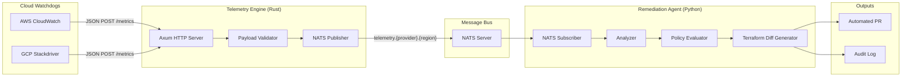
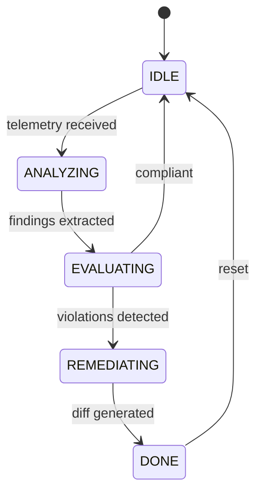

# ZenithOS — System Architecture

## Data Flow

## Component Detail

## Protocol Summary

| Leg | Protocol | Format | Subject Pattern |
|---|---|---|---|
| Watchdog → Rust | HTTP/1.1 POST | JSON | `/metrics` |
| Rust → NATS | NATS Pub | JSON | `telemetry.{aws\|gcp}.{region}` |
| NATS → Python | NATS Sub | JSON | `telemetry.>` (wildcard) |

## Performance: ZenithOS vs Traditional APM Agents

| Dimension | ZenithOS | Datadog Agent | New Relic Infrastructure |
|---|---|---|---|
| **Memory overhead** | ~0 on monitored host (push model; engine runs separately) | 250–400 MB resident per host (sidecar daemon) | 100–200 MB per host |
| **CPU cost** | Near-zero on host; engine uses async I/O (~2% single core at 50k metrics/s) | 1–5% sustained per host for collection + local aggregation | 1–3% sustained |
| **Ingestion latency** | Sub-millisecond deserialization → NATS publish (~200 µs p99) | 10–15 s collection interval (batched) | 5–15 s collection interval |
| **Network** | Single POST per batch from watchdog; NATS binary protocol internally | Persistent HTTPS to SaaS endpoint + local IPC | HTTPS to collector |
| **Agent upgrades** | No per-host agent to upgrade | Rolling restart of sidecar on every host | Same |
| **Remediation** | Automated — generates Terraform diffs in seconds | Manual — alerts → human → ticket → change | Manual |

**Key advantage**: ZenithOS eliminates the per-host agent daemon entirely. Cloud-native watchdogs (CloudWatch, Stackdriver) already collect metrics; ZenithOS taps their existing event streams via push webhooks, so the only infrastructure to run is the centralized Rust engine and Python agent — both horizontally scalable and stateless.
